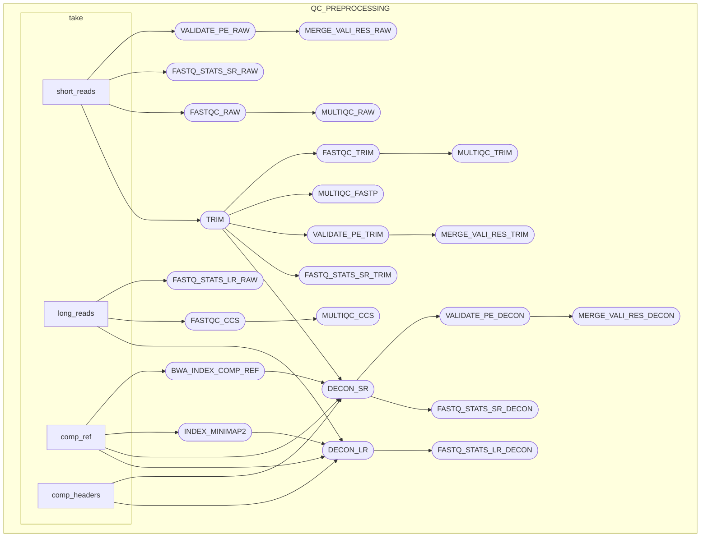

# stammerula2025

```mermaid
flowchart TB

    %% Parameters
    subgraph " "
        subgraph params
            meta["metadata"]
            refs["references"]
        end
        STAM([STAM_PIPELINE])
        meta --> STAM
        refs --> STAM
    end

    %% STAM_PIPELINE Workflow
    subgraph STAM_PIPELINE
        subgraph take
            sr["short_reads"]
            lr["long_reads"]
            cref["comp_ref"]
            chead["comp_headers"]
        end
        QC([QC_PREPROCESSING])
        FM([FILE_MERGER])
        sr --> QC
        lr --> QC
        cref --> QC
        chead --> QC
        QC --> FM
    end

    %% QC_PREPROCESSING Workflow
    subgraph QC_PREPROCESSING
        subgraph take
            qsr["short_reads"]
            qlr["long_reads"]
            qref["comp_ref"]
            qhead["comp_headers"]
        end

        VRAW([VALIDATE_PE_RAW])
        MRAW([MERGE_VALI_RES_RAW])
        SRAW([FASTQ_STATS_SR_RAW])
        SLRAW([FASTQ_STATS_LR_RAW])
        FQR([FASTQC_RAW])
        MQR([MULTIQC_RAW])
        FQCCS([FASTQC_CCS])
        MQCCS([MULTIQC_CCS])
        TR([TRIM])
        FQT([FASTQC_TRIM])
        MQT([MULTIQC_TRIM])
        MQFP([MULTIQC_FASTP])
        VTRIM([VALIDATE_PE_TRIM])
        MTRIM([MERGE_VALI_RES_TRIM])
        STRIM([FASTQ_STATS_SR_TRIM])
        IDX([BWA_INDEX_COMP_REF])
        MMI([INDEX_MINIMAP2])
        DSR([DECON_SR])
        DLR([DECON_LR])
        VDECON([VALIDATE_PE_DECON])
        MDECON([MERGE_VALI_RES_DECON])
        SDECON([FASTQ_STATS_SR_DECON])
        SLDECON([FASTQ_STATS_LR_DECON])

        subgraph emit
            dsr_out["decon_sr_reads"]
            dlr_out["decon_lr_reads"]
        end

        qsr --> VRAW --> MRAW
        qsr --> SRAW
        qlr --> SLRAW
        qsr --> FQR --> MQR
        qlr --> FQCCS --> MQCCS
        qsr --> TR
        TR --> FQT --> MQT
        TR --> MQFP
        TR --> VTRIM --> MTRIM
        TR --> STRIM

        qref --> IDX --> DSR
        qref --> MMI --> DLR
        qref --> DLR
        qhead --> DSR
        qhead --> DLR
        TR --> DSR
        qlr --> DLR

        DSR --> VDECON --> MDECON
        DSR --> SDECON
        DLR --> SLDECON

        DSR --> dsr_out
        DLR --> dlr_out
    end

    %% FILE_MERGER Workflow
    subgraph FILE_MERGER
        subgraph take
            dsr_in["decon_sr_reads"]
        end
        MS([mergeBySample])
        subgraph emit
            mreads["merged_reads"]
        end
        dsr_in --> MS --> mreads
    end

    %% Connect QC emit to FILE_MERGER take
    dsr_out --> dsr_in

```

```mermaid
flowchart TB
    subgraph QC_PREPROCESSING
    subgraph take
    v0["short_reads"]
    v1["long_reads"]
    v2["comp_ref"]
    v3["comp_headers"]
    end
    v5([VALIDATE_PE_RAW])
    v7([MERGE_VALI_RES_RAW])
    v10([FASTQ_STATS_SR_RAW])
    v11([FASTQ_STATS_LR_RAW])
    v13([FASTQC_RAW])
    v15([MULTIQC_RAW])
    v17([FASTQC_CCS])
    v19([MULTIQC_CCS])
    v20([TRIM])
    v22([FASTQC_TRIM])
    v24([MULTIQC_TRIM])
    v26([MULTIQC_FASTP])
    v28([VALIDATE_PE_TRIM])
    v30([MERGE_VALI_RES_TRIM])
    v32([FASTQ_STATS_SR_TRIM])
    v33([BWA_INDEX_COMP_REF])
    v35([INDEX_MINIMAP2])
    v37([DECON_SR])
    v38([DECON_LR])
    v40([VALIDATE_PE_DECON])
    v42([MERGE_VALI_RES_DECON])
    v45([FASTQ_STATS_SR_DECON])
    v46([FASTQ_STATS_LR_DECON])
    v0 --> v5
    v5 --> v7
    v0 --> v10
    v1 --> v11
    v0 --> v13
    v13 --> v15
    v1 --> v17
    v17 --> v19
    v0 --> v20
    v20 --> v22
    v22 --> v24
    v20 --> v26
    v20 --> v28
    v28 --> v30
    v20 --> v32
    v2 --> v33
    v2 --> v35
    v33 --> v37
    v2 --> v37
    v3 --> v37
    v20 --> v37
    v1 --> v38
    v2 --> v38
    v3 --> v38
    v35 --> v38
    v37 --> v40
    v40 --> v42
    v37 --> v45
    v38 --> v46
    end
```
