# stammerula2025
[](https://www.nextflow.io/) [](https://docs.conda.io/en/latest/)
 
## Introduction
**stammerula2025** is a  metagenomics analysis workflow designed for processing both short-read (Illumina) and long-read (PacBio HiFi) sequencing data. This pipeline performs quality control, decontamination, assembly, and binning to extract high-quality metagenome-assembled genomes (MAGs) from metagenomic samples.

## Pipeline Overview
The pipeline consists of several key stages:

1. **Quality Control & Trimming**  - Verifies and validates after each step.
2. **Decontamination** - Competitive mapping
3.  **Assembly** - Hybrid assembly using both short and long reads
4. **Binning** - Metagenomic binning and bin refinement
5. **MAG Assessment** - Annotation, taxonomic classification and MAG quality.

## Pipeline Architecture

```mermaid
flowchart TD
    %% Input Data Sources
    subgraph "📁 Input Data"
        SR_META[Short-Read Metadata<br/>CSV File]
        LR_META[Long-Read Metadata<br/>CSV File]
        COMP_REF[Competitive Reference<br/>Database]
        SR_RAW[Short Reads<br/>Illumina FASTQ]
        LR_RAW[Long Reads<br/>PacBio HiFi FASTQ]
    end

    %% Data Initialization
    subgraph "🔧 Data Initialization"
        INIT[INIT Subworkflow<br/>Parse metadata & load files]
    end

    %% Phase 1: Quality Control & Preprocessing
    subgraph "🧹 Phase 1: Quality Control & Preprocessing"
        TRIM[TRIM_READS<br/>fastp trimming]
        DECON_SR[DECON_SR<br/>Short-read decontamination<br/>BWA alignment]
        DECON_LR[DECON_LR<br/>Long-read decontamination<br/>minimap2 alignment]
        
        subgraph "📊 Raw QC Reports"
            FASTQC_RAW[FastQC Raw Reads]
            MULTIQC_RAW[MultiQC Raw Report]
            FASTQC_CCS[FastQC HiFi Reads]
            MULTIQC_CCS[MultiQC HiFi Report]
        end
        
        subgraph "📊 Post-Trim QC"
            FASTQC_TRIM[FastQC Trimmed]
            MULTIQC_TRIM[MultiQC Trimmed]
            MULTIQC_FASTP[MultiQC fastp Report]
        end
    end

    %% Phase 2: Read Organization
    subgraph "📦 Phase 2: Read Organization"
        MERGE_SAMPLE[MERGE_BY_SAMPLE<br/>Combine reads by sample]
        MERGE_POP[MERGE_BY_POP<br/>Combine reads by population]
        
        subgraph "📊 Merged QC"
            FASTQC_SAMPLE[FastQC Sample Merged]
            MULTIQC_SAMPLE[MultiQC Sample Report]
            FASTQC_POP[FastQC Population Merged]
            MULTIQC_POP[MultiQC Population Report]
        end
    end

    %% Phase 3: Validation & Statistics
    subgraph "✅ Phase 3: Validation & Statistics"
        subgraph "🔍 FASTQ Validation"
            VALIDATE_RAW[Validate Raw Reads]
            VALIDATE_TRIM[Validate Trimmed Reads]
            VALIDATE_DECON[Validate Decontaminated]
            VALIDATE_SAMPLE[Validate Sample Merged]
            VALIDATE_POP[Validate Population Merged]
        end
        
        subgraph "📈 Statistics Generation"
            STATS_SR_RAW[Short-Read Raw Stats]
            STATS_LR_RAW[Long-Read Raw Stats]
            STATS_SR_TRIM[Short-Read Trim Stats]
            STATS_SR_DECON[Short-Read Decon Stats]
            STATS_LR_DECON[Long-Read Decon Stats]
            STATS_SAMPLE[Sample Merge Stats]
            STATS_POP[Population Merge Stats]
        end
    end

    %% Phase 4: Assembly
    subgraph "🧬 Phase 4: Assembly"
        SHORT_ASM[SHORT_ASSEMBLY<br/>MEGAHIT<br/>Population-level assembly]
        LONG_ASM[LONG_ASSEMBLY<br/>metaMDBG<br/>HiFi assembly]
    end

    %% Phase 5: Binning
    subgraph "📦 Phase 5: Binning & Refinement"
        BINNING_PROC[metaWRAP Binning<br/>CONCOCT + MaxBin2 + MetaBAT2]
        BIN_REFINE[Bin Refinement<br/>metaWRAP refinement]
    end

    %% Phase 6: Quality Assessment
    subgraph "🔬 Phase 6: MAG Quality Assessment"
        GTDBTK[GTDB-Tk<br/>Taxonomic Classification<br/>🗄️ GTDB Database]
        CHECKM2[CheckM2<br/>Completeness & Contamination<br/>🗄️ CheckM2 Database]
        BUSCO[BUSCO<br/>Gene Completeness<br/>🗄️ BUSCO Database]
        BAKTA[Bakta<br/>Genome Annotation<br/>🗄️ Bakta Database]
    end

    %% Output Results
    subgraph "📤 Final Outputs"
        RESULTS_QC[Quality Control Reports]
        RESULTS_ASM[Assembled Metagenomes]
        RESULTS_BINS[Refined MAG Bins]
        RESULTS_TAX[Taxonomic Classifications]
        RESULTS_QUAL[Quality Assessments]
        RESULTS_ANNOT[Genome Annotations]
    end

    %% Flow Connections
    SR_META --> INIT
    LR_META --> INIT
    COMP_REF --> INIT
    
    INIT --> SR_RAW
    INIT --> LR_RAW
    INIT --> COMP_REF
    
    %% Phase 1 Flow
    SR_RAW --> TRIM
    SR_RAW --> FASTQC_RAW --> MULTIQC_RAW
    LR_RAW --> FASTQC_CCS --> MULTIQC_CCS
    LR_RAW --> DECON_LR
    
    TRIM --> DECON_SR
    TRIM --> FASTQC_TRIM --> MULTIQC_TRIM
    TRIM --> MULTIQC_FASTP
    
    COMP_REF --> DECON_SR
    COMP_REF --> DECON_LR
    
    %% Phase 2 Flow
    DECON_SR --> MERGE_SAMPLE
    DECON_SR --> MERGE_POP
    
    MERGE_SAMPLE --> FASTQC_SAMPLE --> MULTIQC_SAMPLE
    MERGE_POP --> FASTQC_POP --> MULTIQC_POP
    
    %% Phase 3 Flow
    SR_RAW --> VALIDATE_RAW --> STATS_SR_RAW
    LR_RAW --> STATS_LR_RAW
    TRIM --> VALIDATE_TRIM --> STATS_SR_TRIM
    DECON_SR --> VALIDATE_DECON --> STATS_SR_DECON
    DECON_LR --> STATS_LR_DECON
    MERGE_SAMPLE --> VALIDATE_SAMPLE --> STATS_SAMPLE
    MERGE_POP --> VALIDATE_POP --> STATS_POP
    
    %% Phase 4 Flow
    MERGE_POP --> SHORT_ASM
    DECON_LR --> LONG_ASM
    
    %% Phase 5 Flow
    LONG_ASM --> BINNING_PROC
    MERGE_POP --> BINNING_PROC
    BINNING_PROC --> BIN_REFINE
    
    %% Phase 6 Flow
    BIN_REFINE --> GTDBTK
    BIN_REFINE --> CHECKM2
    BIN_REFINE --> BUSCO
    BIN_REFINE --> BAKTA
    
    %% Output Flow
    MULTIQC_RAW --> RESULTS_QC
    MULTIQC_CCS --> RESULTS_QC
    MULTIQC_TRIM --> RESULTS_QC
    MULTIQC_FASTP --> RESULTS_QC
    MULTIQC_SAMPLE --> RESULTS_QC
    MULTIQC_POP --> RESULTS_QC
    
    SHORT_ASM --> RESULTS_ASM
    LONG_ASM --> RESULTS_ASM
    
    BIN_REFINE --> RESULTS_BINS
    
    GTDBTK --> RESULTS_TAX
    CHECKM2 --> RESULTS_QUAL
    BUSCO --> RESULTS_QUAL
    BAKTA --> RESULTS_ANNOT
    
    %% Styling
    classDef inputData fill:#e1f5fe,stroke:#01579b,stroke-width:2px
    classDef qcProcess fill:#f3e5f5,stroke:#4a148c,stroke-width:2px
    classDef assembly fill:#e8f5e8,stroke:#1b5e20,stroke-width:2px
    classDef binning fill:#fff3e0,stroke:#e65100,stroke-width:2px
    classDef quality fill:#fce4ec,stroke:#880e4f,stroke-width:2px
    classDef output fill:#f1f8e9,stroke:#33691e,stroke-width:2px
    classDef database fill:#fff8e1,stroke:#f57f17,stroke-width:2px
    
    class SR_META,LR_META,COMP_REF,SR_RAW,LR_RAW inputData
    class TRIM,DECON_SR,DECON_LR,FASTQC_RAW,MULTIQC_RAW,FASTQC_CCS,MULTIQC_CCS,FASTQC_TRIM,MULTIQC_TRIM,MULTIQC_FASTP,MERGE_SAMPLE,MERGE_POP,FASTQC_SAMPLE,MULTIQC_SAMPLE,FASTQC_POP,MULTIQC_POP qcProcess
    class SHORT_ASM,LONG_ASM assembly
    class BINNING_PROC,BIN_REFINE binning
    class GTDBTK,CHECKM2,BUSCO,BAKTA quality
    class RESULTS_QC,RESULTS_ASM,RESULTS_BINS,RESULTS_TAX,RESULTS_QUAL,RESULTS_ANNOT output
```



## Quick Start

1. Install [`Nextflow`](https://www.nextflow.io/docs/latest/getstarted.html#installation) (`>=23.04.0`)
2. Install apptainer
3. Clone the repository:

```bash
   git clone https://github.com/ndreey/stammerula2025.git
   cd stammerula2025
   ```

4. Prepare your metadata files (see [Input](#input) section)

5. Run the pipeline:

```bash
   nextflow run main.nf -params-file stam-params.yml -profile slurm
```

  
## Input Requirements

### 1. Short-Read Metadata (`metadata.sr`)
CSV file with columns:
- `POP`: Population identifier
- `HP`: Host plant
- `REG`: Region
- `regHP`: Region-host combination
- `SAMPLE`: Sample identifier
- `LANE`: Sequencing lane
- `READ1`: Path to R1 FASTQ file
- `READ2`: Path to R2 FASTQ file

### 2. Long-Read Metadata (`metadata.lr`)
CSV file with columns:
- `POP`: Population identifier
- `SAMPLE`: Sample identifier
- `CELL`: SMRT cell identifier
- `READ`: Path to HiFi FASTQ file

### 3. Competitive Reference
- `comp_ref_dir`: Directory containing reference genome
- `comp_ref_fasta`: Reference FASTA file
- `comp_headers`: File with reference sequence headers


## Parameters
Key parameters can be configured in `stam-params.yml`:

### Input/Output
- `metadata.sr`: Path to short-read metadata CSV
- `metadata.lr`: Path to long-read metadata CSV
- `references.comp.dir`: Competitive reference directory
- `references.comp.fasta`: Comp. reference FASTA file
- `references.comp.headers`: Comp. reference headers file
  
### Quality Control
- `trim.avg_qual`: Average quality threshold (default: 20)
- `trim.len_req`: Minimum length required (default: 50)

## Output

The pipeline generates several output directories:

```
results/
├── 00-QC/                          # Quality control reports
│   ├── fastqc-raw/                 # Raw read FastQC
│   ├── fastqc-trim/                # Trimmed read FastQC
│   ├── multiqc-raw/                # Raw read MultiQC
│   └── multiqc-trim/               # Trimmed read MultiQC
├── 01-trimmed/                     # Trimmed reads
├── 02-decontamination/             # Decontaminated reads
│   ├── clean-reads/                # Short reads
│   └── clean-reads-lr/             # Long reads
├── 03-sample-merged-sr/            # Sample-merged short reads
├── 04-pop-merged-sr/               # Population-merged short reads
├── 05-metagenomes/                 # Assembled metagenomes
│   ├── 01-metamdbg/                # Long-read assemblies
│   └── 02-megahit/                 # Short-read assemblies
├── 06-metaWRAP-refined-bins/       # Initial and refined bins
└── 07-bin-quality-assessment/      # Output to evaluate MAG quality.
```


  

## Resource Requirements

 ## Container Support

The pipeline uses Wave containers for reproducibility. Containers are automatically pulled when using Apptainer or other supported container engines.


  

## Citation
If you use stammerula2025 for your analysis, please cite:

> **stammerula2025: fancy title**
> *Author et al.* (2025)

And following programs that made this pipeline possible:

| Tool               | Version | Link |
| ------------------ | ------- | ---- |
| fastp              | 0.23.4  |      |
| Kraken2            | 2.1.2   |      |
| BWA-MEM            | 0.7.17  |      |
| BEDTools           | 2.31.1  |      |
| Minimap2           | 2.26    |      |
| SPAdes             | 3.15.5  |      |
| metaSPAdes         | 3.15.5  |      |
| hybridSPAdes       | 3.15.5  |      |
| Anvio              | 8.0     |      |
| Bowtie2            | tba     |      |
| Prodigal           | 2.6.3   |      |
| metaWRAP           | 1.3.2   |      |
| CONCOCT            | 1.0.0   |      |
| MaxBin2            | 2.2.7   |      |
| MetaBAT2           | 2.15    |      |
| CheckM             | 1.0.18  |      |
| CheckM2            | 1.0.1   |      |
| BUSCO              | 5.5.0   |      |
| GTDB-Tk            | 2.4.0   |      |
| Bakta              | 1.9.3   |      |
| BLAST+             | 2.15.0  |      |
| R script dotPlotly | N/A     |      |

## Support
For questions and support:
- Open an issue on [GitHub](https://github.com/ndreey/stammerula2025/issues)
- Check the [documentation](https://github.com/ndreey/stammerula2025)

## License
This project is licensed under the MIT License - see the [LICENSE](LICENSE) file for details.

---


*Pipeline developed by André Bourbonnais (ndreey) for Master Thesis research*